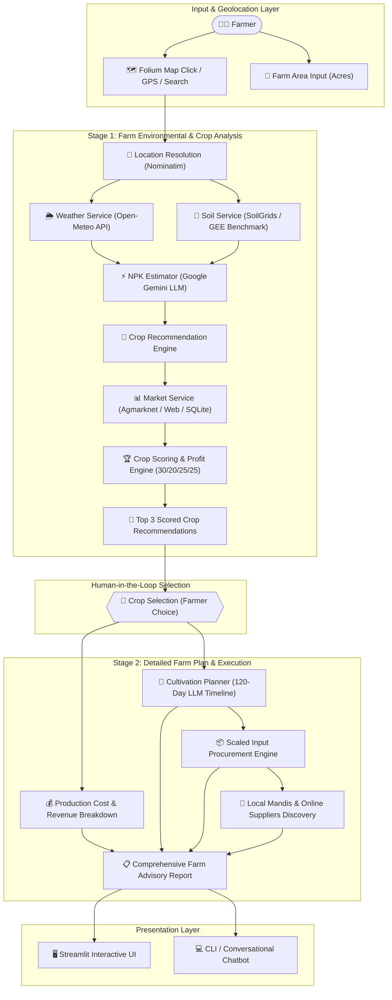
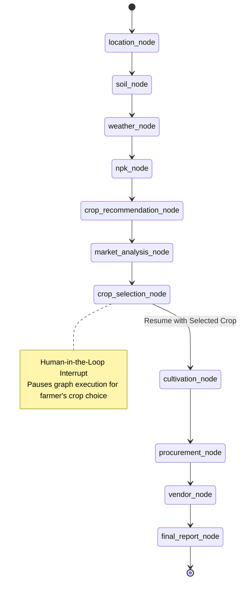

# 🌱 AgriSense AI

> **Intelligent Multi-Stage Agricultural Advisory & Precision Farm Planning Platform**  
> *Powered by Google Gemini, LangChain, LangGraph, Open-Meteo, SoilGrids, and Streamlit.*

---

## 📌 Overview

### The Agricultural Challenge
Smallholder and commercial farmers face high uncertainty when deciding which crops to sow each season. Decisions are frequently made based on intuition or historical habit rather than dynamic data:
- **Volatile Weather Patterns:** Unpredictable rainfall and temperature shifts increase crop failure risks.
- **Unmeasured Soil & Nutrient Deficits:** Lack of access to soil testing labs leaves farmers guessing NPK (Nitrogen, Phosphorus, Potassium) requirements.
- **Market Price Disconnect:** Sowing decisions are often divorced from real-time mandi prices and harvest-time price trends.
- **Execution & Procurement Gaps:** Farmers lack customized day-by-day cultivation roadmaps and transparent sourcing for agricultural inputs scaled to their land area.

### How AgriSense AI Solves This
**AgriSense AI** is an AI-driven agricultural advisory system engineered to eliminate guesswork across the entire crop lifecycle. By fusing geographic positioning, real-time meteorological telemetry, soil properties, machine learning crop models, commodity market intelligence, and Google Gemini LLMs, AgriSense provides actionable farm advisory in two streamlined stages:

1. **Stage 1: Farm Analysis & Crop Scoring** — Analyzes local agro-climatic conditions (temperature, humidity, precipitation, soil pH, texture, NPK balance) and computes multi-factor profitability scores for top crop candidates.
2. **Stage 2: Precision Farm Execution & Procurement Plan** — Generates a 120-day cultivation schedule, scales required inputs (seeds, fertilizers, mulch, irrigation kits) to the farmer's exact acreage, projects net profit margins, and discovers nearby mandis/dealers and certified online suppliers.

---

## ✨ Features

- **🗺️ Interactive Map Selection:** Folium-powered OpenStreetMap interface centered on India with click-to-pin coordinate capture.
- **📍 GPS Location Support:** Browser HTML5 Geolocation bridge for instant farmland coordinate detection in the field.
- **🔍 Manual Location Search:** Forward geocoding powered by OpenStreetMap Nominatim for searching cities, districts, and towns across India.
- **🌦️ Real-Time Weather Telemetry:** Live meteorological data (temperature, relative humidity, precipitation, apparent temperature) fetched from Open-Meteo API.
- **🧪 Soil Health Profiling:** Soil characteristics (pH, nitrogen levels, organic carbon, sand/silt/clay texture ratios) modeled from SoilGrids / Earth Engine benchmarks with local agronomic fallbacks.
- **⚡ AI NPK Estimation:** Google Gemini LLM estimates required soil NPK nutrient baselines ($N, P, K$ in kg/ha) based on real-time soil properties and atmospheric conditions.
- **🌾 Machine Learning Crop Recommendation:** Integration with crop prediction models to evaluate agro-climatic suitability.
- **📊 Commodity Market Intelligence:** Multi-source market analysis using Agmarknet / Data.gov.in APIs, web evidence retrieval (DuckDuckGo/BeautifulSoup), and SQLite historical price databases.
- **📈 Harvest Price Trend Forecasting:** Computes price momentum (*increasing*, *decreasing*, *stable*) and estimates expected harvest price at maturity.
- **💰 Area-Scaled Profit Estimation:** Comprehensive financial modeling calculating gross revenue, cultivation costs, and net projected profit scaled to custom farm acreage (e.g. 0.5, 1.2, 5.0, 10.0+ acres).
- **🏆 Multi-Factor Crop Ranking:** Weighted scoring algorithm ($30\%$ Soil Suitability + $20\%$ Weather Compatibility + $25\%$ Market Margin + $25\%$ Profit Yield) to surface the **Top 3 Recommended Crops**.
- **🌱 Interactive Crop Selection Workflow:** Allows farmers to select their preferred crop from the top candidates to trigger deep-dive planning.
- **📅 120-Day Cultivation Timeline:** Structured day-by-day agronomic execution roadmap spanning land preparation, sowing, nutrient schedules, irrigation, and harvesting.
- **📦 Scaled Procurement Planning:** Calculates exact quantities of seeds, fertilizers, organic manure, bio-nutrients, mulch, and irrigation kits calibrated to the farmer's land area.
- **🏪 Local & Online Vendor Discovery:** Discovers nearby agricultural input dealers, mandis (via Google Maps / Places), and certified online agricultural suppliers with direct links.
- **🤖 LangGraph Conversational Workflow:** Production-grade state machine with typed state (`AgriState`), human-in-the-loop checkpointing (`MemorySaver`), and interruptible nodes.
- **🧠 Google Gemini Integration:** Zero-shot and structured JSON generation for agronomic reasoning, market synthesis, and cultivation workflows.

---

## 🏛️ System Architecture



---

## 🛠️ Technology Stack

| Layer | Technologies | Description |
| :--- | :--- | :--- |
| **Frontend & UI** | **Streamlit**, **Folium**, **OpenStreetMap**, **streamlit-folium** | Interactive dashboard with custom CSS, responsive metric cards, and live map click listeners. |
| **Backend & Runtime** | **Python 3.10+** | Modular service-oriented backend architecture with typed contracts. |
| **LLM & Orchestration** | **Google Gemini** (`gemini-flash-lite-latest`), **LangChain** (`langchain-google-genai`), **LangGraph** | Advanced reasoning, JSON schema enforcement, state machine graph workflows, and human-in-the-loop interruptions. |
| **Telemetry & Geo** | **Open-Meteo REST API**, **geopy** (Nominatim OpenStreetMap) | Sub-kilometer forward/reverse geocoding and real-time precipitation, humidity, and temperature data. |
| **Data & Scraping** | **pandas**, **requests**, **BeautifulSoup4**, **SQLite3** | Market scraping, mandi price parsing, offline commodity fallbacks, and tabular transformation. |

---

## 📁 Project Structure

```
AgriSense/
├── app.py                          # Streamlit interactive web dashboard
├── main.py                         # Unified CLI launcher / compatibility entrypoint
├── agri_chatbot.py                 # Interactive terminal chatbot using LangGraph workflow
├── crop_tool.py                    # External ML model client for crop prediction
├── weather_tool.py                 # Weather service test utility
├── tools.py                        # Shared utility tools
├── create_db.py                    # SQLite database creation & seeding script
├── database.py                     # SQLite query verification utility
├── gemini_test.py                  # Google Gemini API validation script
├── openai_test.py                  # Baseline test script
├── requirements.txt                # Production Python dependencies
├── .env                            # Environment configuration (API keys)
│
├── database/
│   └── agrisense.db                # SQLite database (crops, benchmark prices, fertilizers)
│
├── graph/                          # LangGraph state machine workflow
│   ├── __init__.py
│   ├── state.py                    # Typed state definition (AgriState)
│   └── workflow.py                 # Compiled StateGraph with interruptible nodes
│
└── services/                       # Core modular service layer
    ├── agrisense_service.py        # Master pipeline orchestrating weather, soil, NPK & crop recs
    ├── crop_scoring_service.py     # Multi-metric crop scoring (Soil 30%, Weather 20%, Market 25%, Profit 25%)
    ├── cultivation_service.py      # LLM 120-day timeline generator & item extraction
    ├── execution_plan_service.py   # Scheduled task generator for irrigation, sowing & harvest
    ├── farm_advisor_service.py     # Two-stage business logic (analyze_farm & generate_crop_detailed_plan)
    ├── llm_service.py              # Central Google Gemini model wrapper with JSON parsing
    ├── location_service.py         # Forward & reverse geocoding via Nominatim
    ├── market_price_service.py     # Market price query helpers
    ├── market_service.py           # Agmarknet API, DuckDuckGo web scraper & SQLite commodity store
    ├── npk_estimation_service.py   # Gemini-powered soil NPK estimation
    ├── procurement_service.py      # Acreage-scaled farm input calculation
    ├── recommendation_engine.py    # Agronomic evidence & top recommendation synthesis
    ├── soil_service.py             # SoilGrids / Earth Engine profile & agronomic classifier
    ├── vendor_service.py           # Local mandi discovery & online supplier links
    └── weather_service.py          # Open-Meteo real-time weather client
```

---

## 🔄 Two-Stage Advisory Workflow

AgriSense AI uses an optimized two-stage design to maximize response speed and conserve LLM tokens:

```
+-----------------------------------------------------------------------------------+
|                           STAGE 1: FARM ANALYSIS                                  |
+-----------------------------------------------------------------------------------+
|  1. Farmer selects location (Map Pin / GPS / City Search) and inputs Farm Area.   |
|  2. System resolves coordinates and fetches Open-Meteo weather telemetry.         |
|  3. System retrieves soil pH, texture & organic carbon.                           |
|  4. Gemini LLM models baseline soil NPK requirements.                             |
|  5. Crop model recommends viable candidate crops for the agro-climatic zone.      |
|  6. Market service gathers mandi prices, price trends, and expected harvest price.|
|  7. Multi-factor scoring engine calculates scores and displays Top 3 Crop Cards.  |
+-----------------------------------------+-----------------------------------------+
                                          |
                                          v (Farmer reviews & clicks "Select Crop")
+-----------------------------------------+-----------------------------------------+
|                    STAGE 2: SELECTED CROP DETAILED PLAN                           |
+-----------------------------------------------------------------------------------+
|  1. Cost Breakdown: Computes seeds (15%), fertilizers (35%), machinery (20%),     |
|     and labor (30%) investment tailored to total acreage.                         |
|  2. Profitability Projections: Yield per acre, gross revenue, net profit margin.  |
|  3. 120-Day Execution Timeline: Gemini generates day-by-day agronomic milestones.  |
|  4. Scaled Procurement: Quantifies exact inputs (kg seeds, bags, mulch rolls).    |
|  5. Vendor Discovery: Discovers nearby mandis/stores and online supplier links.   |
|  6. Scientific Rationale: Formulates agronomic suitability evidence.              |
+-----------------------------------------------------------------------------------+
```

---

## ⚙️ Installation & Setup

### Prerequisites
- Python `3.10` or higher installed on your machine.
- A valid **Google Gemini API Key** (from [Google AI Studio](https://aistudio.google.com/)).

### 1. Clone the Repository
```bash
git clone https://github.com/likithpm/AgriSense.git
cd AgriSense
```

### 2. Create and Activate a Virtual Environment

**On Windows (PowerShell):**
```powershell
python -m venv .venv
.\.venv\Scripts\Activate.ps1
```

**On Windows (Command Prompt):**
```cmd
python -m venv .venv
.\.venv\Scripts\activate.bat
```

**On Linux / macOS:**
```bash
python3 -m venv .venv
source .venv/bin/activate
```

### 3. Install Dependencies
```bash
pip install -r requirements.txt
```

---

## 🔑 Configuration (.env)

Create a `.env` file in the root directory:

```env
# =================================================================
# REQUIRED CONFIGURATION
# =================================================================
# Google Gemini API Key for NPK estimation, cultivation plans, and market analysis
GEMINI_API_KEY=your_google_gemini_api_key_here

# =================================================================
# OPTIONAL CONFIGURATION (Graceful fallbacks exist for all of these)
# =================================================================
# Gemini Model selection (default: gemini-flash-lite-latest)
GEMINI_MODEL=gemini-flash-lite-latest
GEMINI_TEMPERATURE=0.2
GEMINI_TIMEOUT=15.0

# Live Government Mandi Price API (Data.gov.in / Agmarknet)
# If omitted, system falls back to live web search evidence & SQLite historical data
AGMARKNET_API_KEY=your_data_gov_in_api_key_here

# Google Places API Key for local agricultural input dealers & mandi discovery
# If omitted, system automatically generates direct Google Maps search links
GOOGLE_MAPS_API_KEY=your_google_places_api_key_here

# Google Earth Engine Project ID (for deep satellite SoilGrids integration)
# If omitted, system uses calibrated regional soil benchmarks
EARTH_ENGINE_PROJECT_ID=your_gee_project_id_here
```

### Variable Summary

| Variable | Requirement | Description & Fallback |
| :--- | :--- | :--- |
| `GEMINI_API_KEY` | **Required** | Powers NPK estimation, market synthesis, and cultivation planning. |
| `GEMINI_MODEL` | *Optional* | Overrides the Gemini model identifier (`gemini-flash-lite-latest`, `gemini-1.5-flash`, etc.). |
| `AGMARKNET_API_KEY` | *Optional* | Connects to official Indian mandi datasets. Falls back to live web search & local SQLite DB. |
| `GOOGLE_MAPS_API_KEY` | *Optional* | Fetches structured Google Places ratings. Falls back to direct Google Maps search URLs. |
| `EARTH_ENGINE_PROJECT_ID`| *Optional* | Authenticates GEE satellite imagery. Falls back to regional SoilGrids heuristics. |

---

## 🚀 Running the Application

### 1. Interactive Streamlit Web Dashboard
Launch the full two-stage web application:
```bash
streamlit run app.py
```
Open your browser and navigate to `http://localhost:8501`.

### 2. Conversational Terminal Chatbot (LangGraph)
Run the interruptible conversational agent in your terminal:
```bash
python main.py
```
*or directly:*
```bash
python agri_chatbot.py
```

---

## 📖 Example User Journey

```
Step 1: Farmland Geolocation
----------------------------
The farmer opens the AgriSense dashboard. They have 3 options:
  a) Click on their farmland location directly on the interactive India map.
  b) Click "📍 Use Current GPS Location" to auto-detect their field via browser GPS.
  c) Enter their district/city (e.g. "Coimbatore, Tamil Nadu") and click "🔍 Search & Pin".

Step 2: Acreage Configuration
-----------------------------
The farmer enters their land area:
  🌾 Total Farm Area: 2.5 Acres

Step 3: Farm Environmental Telemetry & Scoring
----------------------------------------------
The farmer clicks "🔍 Analyze Farm". The platform performs Stage 1 processing:
  • Location: Coimbatore, Tamil Nadu (11.0168° N, 76.9558° E)
  • Weather: 28.4°C Temperature, 68% Humidity, 12.5 mm Rainfall
  • Soil Health: pH 6.7, Medium Nitrogen, High Organic Carbon (Red Loamy)
  • Modeled NPK: N: 85 kg/ha | P: 44 kg/ha | K: 48 kg/ha
  • The Top 3 Crop Cards are rendered:
      1. Tomato    | Score: 88 | Price: ₹2,200/Qtl | Net Profit: ₹2,75,000 (2.5 Acres)
      2. Onion     | Score: 82 | Price: ₹2,400/Qtl | Net Profit: ₹2,10,000 (2.5 Acres)
      3. Groundnut | Score: 78 | Price: ₹6,800/Qtl | Net Profit: ₹1,85,000 (2.5 Acres)

Step 4: Precision Farm Plan Generation
--------------------------------------
The farmer reviews the recommendations and clicks "🌱 Select Tomato".
The platform executes Stage 2:
  • Financial Breakdown: Seed cost (₹31,875), Fertilizers (₹74,375), Operations (₹63,750), Labor (₹42,500).
  • 120-Day Timeline: Land preparation on Day 1, sowing on Day 7, NPK top-dress on Day 15, harvest on Day 120.
  • Scaled Inputs: 6.25 kg hybrid tomato seeds, 6 bags NPK (50kg), 10 tonnes organic manure, 5 rolls mulch.
  • Vendor Sourcing: Nearby agro-service centers with Google Maps directions & certified online seed suppliers.
```

---

## 🧠 LangChain Usage

LangChain (`langchain-google-genai`) is utilized throughout the services layer to provide structured LLM interactions:

1. **Centralized Gemini Client (`services/llm_service.py`):**  
   Initializes `ChatGoogleGenerativeAI` with configurable temperature, timeout, and retry management, wrapping output clean-up and markdown fence stripping.
2. **AI NPK Nutrient Estimation (`services/npk_estimation_service.py`):**  
   Accepts real-time soil properties and atmospheric conditions to prompt the LLM for a strict JSON schema `{ "N": int, "P": int, "K": int }`.
3. **Market Evidence Synthesis (`services/market_service.py`):**  
   Takes unstructured search snippets from mandi portals and prompts the LLM to extract current prices, trend sentiment, and confidence indicators without hallucinating numbers.
4. **120-Day Cultivation Planning (`services/cultivation_service.py`):**  
   Combines web-researched agronomic requirements and prompts Gemini to produce structured, chronological farming milestones with stage tags and actionable activity lists.

---

## 🕸️ LangGraph Architecture

The conversational workflow (`graph/workflow.py`) is structured as a state machine using **LangGraph** `StateGraph` backed by in-memory persistence (`MemorySaver`).

### State Schema (`AgriState`)
```python
class AgriState(TypedDict, total=False):
    location_name: str
    latitude: float
    longitude: float
    farm_area_acres: float
    location: dict[str, Any]
    soil: dict[str, Any]
    weather: dict[str, Any]
    npk: dict[str, Any]
    recommended_crops: list[str]
    top_3_crops: list[dict[str, Any]]
    selected_crop: str
    profit_per_acre: float
    total_profit: float
    market_data: list[dict[str, Any]]
    cultivation_plan: dict[str, Any]
    required_items: list[dict[str, Any]]
    cost_breakdown: dict[str, Any]
    vendors: dict[str, Any]
    online_links: list[dict[str, Any]]
    final_report: dict[str, Any]
    error: str
    awaiting_selection: bool
```

### Graph Workflow Diagram



### Node Responsibilities

| Graph Node | Implementation | Function |
| :--- | :--- | :--- |
| `location_node` | `location_node(state)` | Standardizes place names and coordinates using forward/reverse geocoding. |
| `soil_node` | `soil_node(state)` | Fetches soil pH, texture, and organic matter from SoilGrids / benchmarks. |
| `weather_node` | `weather_node(state)` | Reads current temperature, humidity, and precipitation from Open-Meteo. |
| `npk_node` | `npk_node(state)` | Estimates nitrogen, phosphorus, and potassium requirements using Gemini. |
| `crop_recommendation_node` | `crop_recommendation_node(state)` | Evaluates candidate crops for the agro-climatic profile. |
| `market_analysis_node` | `market_analysis_node(state)` | Fetches mandi prices, trends, profitability and computes Top 3 rankings. |
| `crop_selection_node` | `crop_selection_node(state)` | **Interrupt Node:** Halts execution to solicit farmer's crop choice; resumes on selection. |
| `cultivation_node` | `cultivation_node(state)` | Generates 120-day structured timeline for the chosen crop via Gemini. |
| `procurement_node` | `procurement_node(state)` | Scales required inputs (seeds, fertilizer, mulch) according to acreage. |
| `vendor_node` | `vendor_node(state)` | Queries local input dealers / mandis and retrieves online supplier links. |
| `final_report_node` | `final_report_node(state)` | Aggregates all state properties into a finalized farmer advisory report. |

---

## 🔮 Future Enhancements

- [ ] **Live Google Earth Engine Satellite Integration:** Multi-spectral NDVI vegetation index tracking and live soil moisture sensing.
- [ ] **Real-Time Mandi API Webhooks:** Direct integrations with e-NAM (National Agriculture Market) and state agricultural marketing boards.
- [ ] **Multi-Lingual Regional Audio Interface:** Voice-driven conversational interface supporting Hindi, Tamil, Telugu, Kannada, Marathi, and Bengali.
- [ ] **Computer Vision Plant Pathology:** Smartphone camera crop disease and pest identification with immediate remediation advice.
- [ ] **Water Table & IoT Sensor Ingestion:** Direct telemetry ingestion from on-field soil moisture and smart drip irrigation hardware.

---

## 📄 License

This project is open-source and distributed under the [MIT License](https://opensource.org/licenses/MIT).
